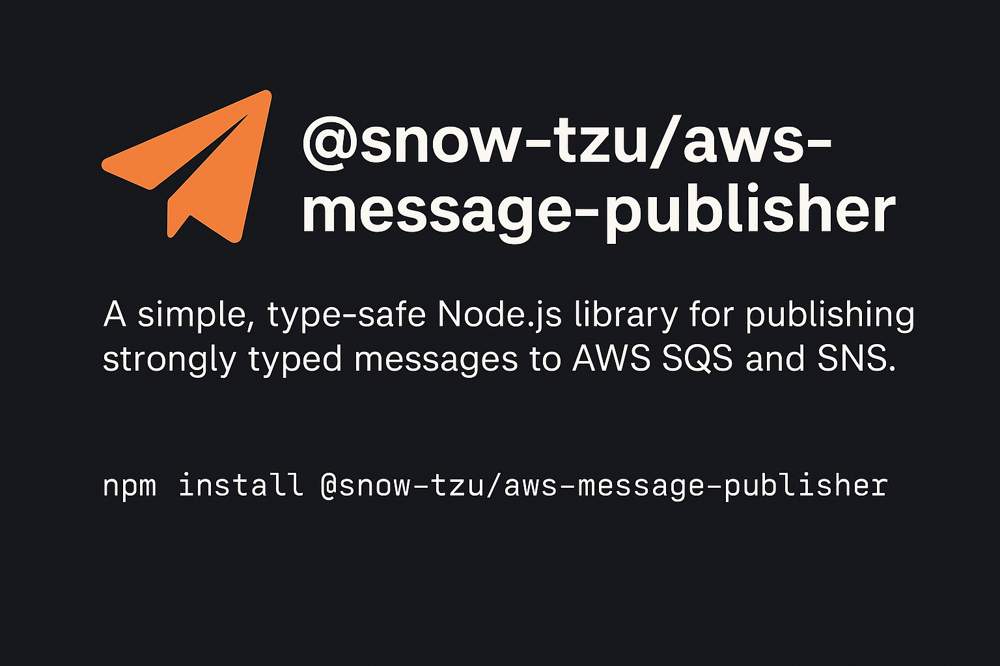

# @snow-tzu/aws-message-publisher

[](https://www.npmjs.com/package/@snow-tzu/aws-message-listener) [](https://github.com/ganesanarun/aws-message-publisher/actions/workflows/build.yml)

Production-ready, framework-agnostic TypeScript package for publishing messages to AWS SNS and SQS. Works with any Node.js application including NestJS, Express, Fastify, or standalone services.



## Features

- 🚀 **SNS and SQS Publishers** - Publish to AWS SNS topics and SQS queues
- 🔧 **Message Enrichment** - Extensible enrichment pipeline with timestamp enricher included
- 📦 **Flexible Serialization** - JSON (default) or implement custom serializers
- 🎯 **Type Safety** - Full TypeScript generics with compile-time validation
- 🔌 **Framework-Agnostic** - Works with NestJS, Express, Fastify, or standalone Node.js
- ⚡ **Batch Publishing** - Efficient batch operations with automatic chunking
- 🛡️ **Error Handling** - Comprehensive error types and descriptive messages
- 🧪 **Fully Tested** - 95%+ test coverage with unit tests

## Table of Contents

- [Requirements](#requirements)
- [Installation](#installation)
- [Quick Start](#quick-start)
  - [Standalone SNS Publisher](#standalone-sns-publisher)
  - [Standalone SQS Publisher](#standalone-sqs-publisher)
- [Configuration](#configuration)
  - [Topic Names vs ARNs / Queue Names vs URLs](#topic-names-vs-arns--queue-names-vs-urls)
  - [Environment Variables](#environment-variables)
- [Framework Integration](#framework-integration)
  - [NestJS Integration](#nestjs-integration)
  - [Express Integration](#express-integration)
- [Advanced Features](#advanced-features)
  - [Message Enrichment](#message-enrichment)
  - [Logging](#logging)
  - [Custom Serialization](#custom-serialization)
  - [Batch Publishing](#batch-publishing)
- [API Reference](#api-reference)
- [Troubleshooting](#troubleshooting)
- [Examples](#examples)
- [Compatibility](#compatibility)
- [Contributing](#contributing)
- [License](#license)
- [Related Packages](#related-packages)
- [Support](#support)

## Requirements

- Node.js >= 18.0.0
- TypeScript >= 5.0.0 (for TypeScript projects)
- AWS SDK v3 (@aws-sdk/client-sns and/or @aws-sdk/client-sqs)

The package is framework-agnostic and works with:
- Standalone Node.js applications
- NestJS >= 10.0.0
- Express
- Fastify
- Any other Node.js framework

## Installation

```bash
yarn add @snow-tzu/aws-message-publisher
```

Or with npm:

```bash
npm install @snow-tzu/aws-message-publisher
```

## Quick Start

### Standalone SNS Publisher

Publish messages to AWS SNS topics with minimal configuration using simple topic names:

```typescript
import { SNSClient } from '@aws-sdk/client-sns';
import { SnsMessagePublisher } from '@snow-tzu/aws-message-publisher';

// Define message type
interface OrderEvent {
  orderId: string;
  status: string;
  timestamp: Date;
}

// Create SNS client
const snsClient = new SNSClient({ region: 'us-east-1' });

// Create and configure publisher with topic name
const publisher = new SnsMessagePublisher<OrderEvent>(snsClient);
publisher.configure(config => config
  .topicName('my-topic')  // Simple topic name - will be resolved to full ARN
);

// Publish a message
const result = await publisher.publish({
  orderId: '123',
  status: 'created',
  timestamp: new Date()
});

console.log('Published message:', result.messageId);
```

**Alternative: Using full ARN**

If you prefer or need to use the full ARN:

```typescript
publisher.configure(config => config
  .topicArn('arn:aws:sns:us-east-1:123456789:my-topic')
);
```

> **💡 Tip:** Using topic names is simpler and more portable across environments. The package automatically resolves names to full ARNs using your AWS client configuration.

### Standalone SQS Publisher

Publish messages directly to AWS SQS queues using simple queue names:

```typescript
import { SQSClient } from '@aws-sdk/client-sqs';
import { SqsMessagePublisher } from '@snow-tzu/aws-message-publisher';

// Define message type
interface TaskMessage {
  orderId: string;
  status: string;
}

// Create SQS client
const sqsClient = new SQSClient({ region: 'us-east-1' });

// Create and configure publisher with queue name
const publisher = new SqsMessagePublisher<TaskMessage>(sqsClient);
publisher.configure(config => config
  .queueName('my-queue')  // Simple queue name - will be resolved to full URL
);

// Publish a message
const result = await publisher.publish({
  orderId: '123',
  status: 'processing'
});

console.log('Published message:', result.messageId);
```

**Alternative: Using full URL**

If you prefer or need to use the full queue URL:

```typescript
publisher.configure(config => config
  .queueUrl('https://sqs.us-east-1.amazonaws.com/123456789/my-queue')
);
```

> **💡 Tip:** Using queue names is simpler and more portable across environments. The package automatically resolves names to full URLs using your AWS client configuration.

## Configuration

### Topic Names vs ARNs / Queue Names vs URLs

The package supports both simple names and full ARNs/URLs for configuration. **We strongly recommend using simple names** for better portability and cleaner code.

#### Why Use Names?

**Benefits of using topic/queue names:**
- ✅ **Simpler configuration** - No need to manage long ARN/URL strings
- ✅ **Environment portability** - Same code works across dev, staging, and production
- ✅ **Cleaner code** - More readable and maintainable
- ✅ **Less error-prone** - No risk of typos in long ARN/URL strings
- ✅ **Automatic resolution** - Package handles ARN/URL resolution using your AWS client config

#### Examples

**SNS - Using Topic Names (Recommended):**
```typescript
// ✅ Recommended - Simple and portable
publisher.configure(config => config.topicName('order-events'));

// ❌ Not recommended - Verbose and environment-specific
publisher.configure(config => config.topicArn('arn:aws:sns:us-east-1:123456789:order-events'));
```

**SQS - Using Queue Names (Recommended):**
```typescript
// ✅ Recommended - Simple and portable
publisher.configure(config => config.queueName('order-queue'));

// ❌ Not recommended - Verbose and environment-specific
publisher.configure(config => config.queueUrl('https://sqs.us-east-1.amazonaws.com/123456789/order-queue'));
```

#### When to Use Full ARNs/URLs

Use full ARNs/URLs only when:
- Working with cross-account resources
- Need to specify resources in different regions than your client
- Integrating with external systems that provide full ARNs/URLs

```typescript
// Cross-account SNS topic
publisher.configure(config => config
  .topicArn('arn:aws:sns:us-east-1:999999999:external-topic')
);

// Cross-region SQS queue
publisher.configure(config => config
  .queueUrl('https://sqs.eu-west-1.amazonaws.com/888888888/remote-queue')
);
```

### Environment Variables

**Recommended approach with names:**
```bash
# .env
ORDER_TOPIC_NAME=order-events
NOTIFICATION_QUEUE_NAME=notifications
```

```typescript
publisher.configure(config => config
  .topicName(process.env.ORDER_TOPIC_NAME)
);
```

**Alternative with full ARNs (not recommended for most cases):**
```bash
# .env
ORDER_TOPIC_ARN=arn:aws:sns:us-east-1:123456789:order-events
```

## Framework Integration

### NestJS Integration

The package works seamlessly with NestJS using dependency injection. Configure AWS clients separately and wire them into publishers.

**Step 1: Create AWS Configuration Module**

```typescript
// aws-config.module.ts
import { Module } from '@nestjs/common';
import { SNSClient } from '@aws-sdk/client-sns';
import { SQSClient } from '@aws-sdk/client-sqs';

@Module({
  providers: [
    {
      provide: 'SNS_CLIENT',
      useFactory: () => {
        return new SNSClient({
          region: process.env.AWS_REGION || 'us-east-1',
        });
      },
    },
    {
      provide: 'SQS_CLIENT',
      useFactory: () => {
        return new SQSClient({
          region: process.env.AWS_REGION || 'us-east-1',
        });
      },
    },
  ],
  exports: ['SNS_CLIENT', 'SQS_CLIENT'],
})
export class AwsConfigModule {}
```

**Step 2: Configure Publisher in Feature Module**

```typescript
// order.module.ts
import { Module } from '@nestjs/common';
import { SNSClient } from '@aws-sdk/client-sns';
import { SnsMessagePublisher, TimestampEnricher } from '@snow-tzu/aws-message-publisher';
import { AwsConfigModule } from './aws-config.module';
import { OrderService } from './order.service';

// Define message type
interface OrderEvent {
  orderId: string;
  status: string;
  timestamp: Date;
}

@Module({
  imports: [AwsConfigModule],
  providers: [
    OrderService,
    {
      provide: 'ORDER_PUBLISHER',
      useFactory: (snsClient: SNSClient) => {
        const publisher = new SnsMessagePublisher<OrderEvent>(snsClient);
        publisher.configure(config => config
          .topicName(process.env.ORDER_TOPIC_NAME)  // Use simple topic name
          .addEnricher(new TimestampEnricher())
        );
        return publisher;
      },
      inject: ['SNS_CLIENT'],
    },
  ],
  exports: ['ORDER_PUBLISHER'],
})
export class OrderModule {}
```

**Step 3: Use Publisher in Service**

```typescript
// order.service.ts
import { Injectable, Inject } from '@nestjs/common';
import { MessagePublisher } from '@snow-tzu/aws-message-publisher';

// Define message type (should match the interface in order.module.ts)
interface OrderEvent {
  orderId: string;
  status: string;
  timestamp: Date;
}

@Injectable()
export class OrderService {
  constructor(
    @Inject('ORDER_PUBLISHER')
    private readonly publisher: MessagePublisher<OrderEvent>
  ) {}

  async createOrder(orderData: any): Promise<void> {
    // Business logic...
    
    // Publish event
    await this.publisher.publish({
      orderId: orderData.id,
      status: 'created',
      timestamp: new Date(),
    });
  }
}
```

### Express Integration

The package works with Express applications using simple instantiation:

```typescript
import express from 'express';
import { SNSClient } from '@aws-sdk/client-sns';
import { SnsMessagePublisher, TimestampEnricher } from '@snow-tzu/aws-message-publisher';

const app = express();
app.use(express.json());

// Define message type
interface OrderEvent {
  orderId: string;
  status: string;
  timestamp: Date;
}

// Create SNS client
const snsClient = new SNSClient({ region: 'us-east-1' });

// Create and configure publisher with topic name
const orderPublisher = new SnsMessagePublisher<OrderEvent>(snsClient);
orderPublisher.configure(config => config
  .topicName(process.env.ORDER_TOPIC_NAME)  // Use simple topic name
  .addEnricher(new TimestampEnricher())
);

// Use in route handlers
app.post('/orders', async (req, res) => {
  try {
    // Business logic...
    
    // Publish event
    const result = await orderPublisher.publish({
      orderId: req.body.id,
      status: 'created',
      timestamp: new Date(),
    });
    
    res.json({ 
      success: true, 
      messageId: result.messageId 
    });
  } catch (error) {
    res.status(500).json({ 
      success: false, 
      error: error.message 
    });
  }
});

app.listen(3000, () => {
  console.log('Server running on port 3000');
});
```

**Organizing Express Publishers:**

For larger applications, create a publishers module:

```typescript
// publishers.ts
import { SNSClient } from '@aws-sdk/client-sns';
import { SQSClient } from '@aws-sdk/client-sqs';
import { SnsMessagePublisher, SqsMessagePublisher, TimestampEnricher } from '@snow-tzu/aws-message-publisher';

// Define message types
interface OrderEvent {
  orderId: string;
  status: string;
  timestamp?: Date;
}

interface NotificationMessage {
  userId: string;
  message: string;
  type: string;
}

const snsClient = new SNSClient({ region: 'us-east-1' });
const sqsClient = new SQSClient({ region: 'us-east-1' });

export const orderPublisher = new SnsMessagePublisher<OrderEvent>(snsClient);
orderPublisher.configure(config => config
  .topicName(process.env.ORDER_TOPIC_NAME)  // Use simple topic name
  .addEnricher(new TimestampEnricher())
);

export const notificationPublisher = new SqsMessagePublisher<NotificationMessage>(sqsClient);
notificationPublisher.configure(config => config
  .queueName(process.env.NOTIFICATION_QUEUE_NAME)  // Use simple queue name
  .addEnricher(new TimestampEnricher())
);

// routes/orders.ts
import { orderPublisher } from '../publishers';

router.post('/orders', async (req, res) => {
  await orderPublisher.publish({ orderId: req.body.id, status: 'created' });
  res.json({ success: true });
});
```

## Advanced Features

### Message Enrichment

Enrichers automatically add metadata attributes to messages before publishing. The package includes a timestamp enricher and provides interfaces for implementing custom enrichers.

#### Built-in Enrichers

##### TimestampEnricher

Adds a timestamp to every published message:

```typescript
import { SnsMessagePublisher, TimestampEnricher } from '@snow-tzu/aws-message-publisher';

interface OrderEvent {
  orderId: string;
  status: string;
}

const publisher = new SnsMessagePublisher<OrderEvent>(snsClient);
publisher.configure(config => config
  .topicName('my-topic')  // Use simple topic name
  .addEnricher(new TimestampEnricher())
);

// Published messages will include a 'timestamp' attribute with ISO 8601 format
```

**Customize field name and format:**

```typescript
// Custom field name
const enricher = new TimestampEnricher('publishedAt');

// Custom date formatter
const enricher = new TimestampEnricher(
  'timestamp',
  (date) => date.getTime().toString() // Unix timestamp
);

// Both customizations
const enricher = new TimestampEnricher(
  'eventTime',
  (date) => date.toISOString()
);
```

#### Custom Enrichers

Create custom enrichers by implementing the `MessageEnricher` interface. This is useful for adding trace IDs, correlation IDs, user context, environment tags, or any application-specific metadata.

##### Example: Trace ID Enricher

```typescript
import { MessageEnricher, MessageAttributes, PublishContext } from '@snow-tzu/aws-message-publisher';

class TraceEnricher implements MessageEnricher {
  constructor(private readonly fieldName: string = 'traceId') {}

  async enrich(message: any, context: PublishContext): Promise<MessageAttributes> {
    // Use context traceId if available, otherwise generate one
    const traceId = context.traceId || this.generateTraceId();
    
    return {
      [this.fieldName]: {
        dataType: 'String',
        value: traceId,
      },
    };
  }

  private generateTraceId(): string {
    return `trace-${Date.now()}-${Math.random().toString(36).substring(2, 11)}`;
  }

  getPriority(): number {
    return 10; // Lower numbers execute first
  }
}

// Use it
interface OrderEvent {
  orderId: string;
  status: string;
}

const publisher = new SnsMessagePublisher<OrderEvent>(snsClient);
publisher.configure(config => config
  .topicName('my-topic')
  .addEnricher(new TraceEnricher())
);
```

##### Example: Correlation ID Enricher

```typescript
class CorrelationEnricher implements MessageEnricher {
  constructor(private readonly fieldName: string = 'correlationId') {}

  async enrich(message: any, context: PublishContext): Promise<MessageAttributes> {
    const correlationId = context.correlationId || this.generateCorrelationId();
    
    return {
      [this.fieldName]: {
        dataType: 'String',
        value: correlationId,
      },
    };
  }

  private generateCorrelationId(): string {
    return `corr-${Date.now()}-${Math.random().toString(36).substring(2, 11)}`;
  }

  getPriority(): number {
    return 20;
  }
}
```

##### Example: Environment Enricher

```typescript
class EnvironmentEnricher implements MessageEnricher {
  constructor(private readonly environment?: string) {}

  async enrich(message: any, context: PublishContext): Promise<MessageAttributes> {
    const env = context.environment || this.environment || process.env.NODE_ENV || 'development';
    
    return {
      environment: {
        dataType: 'String',
        value: env,
      },
    };
  }

  getPriority(): number {
    return 50;
  }
}
```

##### Example: User Context Enricher

```typescript
class UserContextEnricher implements MessageEnricher {
  async enrich(message: any, context: PublishContext): Promise<MessageAttributes> {
    const attributes: MessageAttributes = {};
    
    if (context.userId) {
      attributes.userId = {
        dataType: 'String',
        value: context.userId,
      };
    }
    
    return attributes;
  }

  getPriority(): number {
    return 30;
  }
}
```

#### Enricher Configuration

##### Adding Multiple Enrichers

```typescript
interface OrderEvent {
  orderId: string;
  status: string;
}

const publisher = new SnsMessagePublisher<OrderEvent>(snsClient);
publisher.configure(config => config
  .topicName('my-topic')
  .addEnricher(new TraceEnricher())
  .addEnricher(new CorrelationEnricher())
  .addEnricher(new TimestampEnricher())
  .addEnricher(new EnvironmentEnricher())
);

// Or use enrichers() to set all at once
publisher.configure(config => config
  .topicName('my-topic')
  .enrichers([
    new TraceEnricher(),
    new CorrelationEnricher(),
    new TimestampEnricher(),
    new EnvironmentEnricher(),
  ])
);
```

##### Enricher Execution Order

Enrichers execute in priority order (lower numbers first). If enrichers have the same priority, they execute in the order they were added.

```typescript
interface OrderEvent {
  orderId: string;
  status: string;
}

// Execution order: TraceEnricher (10) → CorrelationEnricher (20) → TimestampEnricher (30)
const publisher = new SnsMessagePublisher<OrderEvent>(snsClient);
publisher.configure(config => config
  .topicName('my-topic')
  .addEnricher(new TimestampEnricher())      // Priority: 30
  .addEnricher(new TraceEnricher())          // Priority: 10
  .addEnricher(new CorrelationEnricher())    // Priority: 20
);
```

##### Attribute Conflicts

If multiple enrichers produce the same attribute key, the last enricher in execution order wins:

```typescript
// Both enrichers set 'timestamp', the second one wins
publisher.configure(config => config
  .topicName('my-topic')
  .addEnricher(new TimestampEnricher('timestamp'))  // Priority: 30
  .addEnricher(new CustomTimestampEnricher())       // Priority: 40, wins
);
```

##### Passing Context to Enrichers

Enrichers receive a `PublishContext` object that can contain runtime information:

```typescript
// Define context when publishing
await publisher.publish(
  { orderId: '123', status: 'created' },
  {
    messageAttributes: {
      // Static attributes
    }
  }
);

// For custom context, extend PublishContext in your enrichers
// and pass context through your application layer
```

### Logging

The publisher supports configurable logging, allowing you to pass your already-configured logger (Winston, Pino, console, NestJS Logger, etc.) directly. The publisher emits structured log messages that your logging framework formats according to its configuration (JSON, pretty print, OpenTelemetry, etc.).

#### Logging Quick Start

##### Using Console Logger

The simplest way to enable logging is to pass the built-in console object:

```typescript
import { SnsMessagePublisher } from '@snow-tzu/aws-message-publisher';

interface OrderEvent {
  orderId: string;
  status: string;
}

const publisher = new SnsMessagePublisher<OrderEvent>(snsClient);
publisher.configure(config => config
  .topicName('my-topic')
  .logger(console)
);

// Logs will appear in console output
await publisher.publish({ orderId: '123', status: 'created' });
// Output: Publishing message { destination: 'arn:aws:sns:...', messageType: 'Object' }
// Output: Message published successfully { messageId: 'abc-123', destination: 'arn:aws:sns:...', duration: 45 }
```

##### Logger Interface

The publisher uses a minimal logger interface compatible with most logging frameworks:

```typescript
interface Logger {
  debug(message: string, context?: Record<string, any>): void;
  info(message: string, context?: Record<string, any>): void;
  warn(message: string, context?: Record<string, any>): void;
  error(message: string, context?: Record<string, any>): void;
}
```

Any object with these four methods can be used as a logger. The publisher never formats logs - it passes a message string and context object to your logger, which handles all formatting.

Check out [examples](./examples)

##### Static Context

Add static context fields that appear in all log messages:

```typescript
interface OrderEvent {
  orderId: string;
  status: string;
}

const publisher = new SnsMessagePublisher<OrderEvent>(snsClient);
publisher.configure(config => config
  .topicName('my-topic')
  .logger(console)
  .logContext({
    service: 'order-service',
    environment: 'production',
    version: '1.0.0'
  })
);

// All logs will include these fields:
// Publishing message { destination: 'arn:...', messageType: 'Object', service: 'order-service', environment: 'production', version: '1.0.0' }
```

Static context is merged with per-message context, with per-message context taking precedence if there are conflicts.

##### Framework Compatibility

The logger interface is compatible with most popular logging frameworks:

**Works directly (no adapter needed):**
- ✅ **console** - Built-in Node.js console
- ✅ **Winston** - `winston.createLogger()`
- ✅ **Pino** - `pino()`
- ✅ **Bunyan** - `bunyan.createLogger()`
- ✅ **Log4js** - `log4js.getLogger()`

**Requires simple adapter:**
- 🔧 **NestJS Logger** - Uses `log()` instead of `info()` (see [NestJS Logger example](./examples/logging-nestjs.ts))

If your logging framework has different method signatures, create a simple adapter:

```typescript
interface OrderEvent {
  orderId: string;
  status: string;
}

// Example: Logger with different method signatures
const customLogger = {
  debug: (msg: string, context?: any) => myLogger.logDebug(msg, context),
  info: (msg: string, context?: any) => myLogger.logInfo(msg, context),
  warn: (msg: string, context?: any) => myLogger.logWarn(msg, context),
  error: (msg: string, context?: any) => myLogger.logError(msg, context)
};

const publisher = new SnsMessagePublisher<OrderEvent>(snsClient);
publisher.configure(config => config.logger(customLogger));
```

##### No Logging by Default

If no logger is configured, the publisher operates silently with zero overhead:

```typescript
interface OrderEvent {
  orderId: string;
  status: string;
}

// No logger configured - no logs emitted
const publisher = new SnsMessagePublisher<OrderEvent>(snsClient);
publisher.configure(config => config.topicName('my-topic'));

await publisher.publish({ orderId: '123', status: 'created' });
// No output - silent operation
```

This ensures logging is opt-in and doesn't impact performance when not needed.

### Custom Serialization

By default, messages are serialized to JSON using the built-in `JsonMessageSerializer`. You can implement custom serializers for other formats like XML, CSV, Protobuf, or any proprietary format.

#### Built-in Serializers

- **JsonMessageSerializer**: Default JSON serialization (automatically used if no serializer is specified)

#### Implementing Custom Serializers

Create custom serializers by implementing the `MessageSerializer` interface:

##### Example: XML Serializer

```typescript
import { MessageSerializer, SerializedMessage, SerializationError } from '@snow-tzu/aws-message-publisher';

class XmlMessageSerializer implements MessageSerializer {
  async serialize(message: any): Promise<SerializedMessage> {
    try {
      // Your XML serialization logic
      const xmlBody = this.convertToXml(message);
      
      return {
        body: xmlBody,
        contentType: 'application/xml',
      };
    } catch (error) {
      throw new SerializationError('Failed to serialize message to XML', error);
    }
  }

  getContentType(): string {
    return 'application/xml';
  }

  private convertToXml(obj: any): string {
    // Simple XML conversion (use a library like 'xml2js' in production)
    const entries = Object.entries(obj);
    const xmlElements = entries.map(([key, value]) => `<${key}>${value}</${key}>`);
    return `<message>${xmlElements.join('')}</message>`;
  }
}

// Use custom serializer
interface OrderEvent {
  orderId: string;
  status: string;
}

const publisher = new SnsMessagePublisher<OrderEvent>(snsClient);
publisher.configure(config => config
  .topicName('my-topic')
  .serializer(new XmlMessageSerializer())
);
```

##### Example: CSV Serializer

```typescript
class CsvMessageSerializer implements MessageSerializer {
  async serialize(message: any): Promise<SerializedMessage> {
    try {
      // Convert object to CSV format
      const keys = Object.keys(message);
      const values = Object.values(message);
      const csv = `${keys.join(',')}\n${values.join(',')}`;
      
      return {
        body: csv,
        contentType: 'text/csv',
      };
    } catch (error) {
      throw new SerializationError('Failed to serialize message to CSV', error);
    }
  }

  getContentType(): string {
    return 'text/csv';
  }
}

// Use CSV serializer
interface OrderEvent {
  orderId: string;
  status: string;
}

const publisher = new SnsMessagePublisher<OrderEvent>(snsClient);
publisher.configure(config => config
  .topicName('my-topic')
  .serializer(new CsvMessageSerializer())
);
```

##### Example: Protobuf Serializer

```typescript
import { MessageSerializer, SerializedMessage, SerializationError } from '@snow-tzu/aws-message-publisher';
import { Message } from 'protobufjs';

class ProtobufMessageSerializer<T extends Message> implements MessageSerializer<T> {
  constructor(private readonly messageType: typeof Message) {}

  async serialize(message: T): Promise<SerializedMessage> {
    try {
      const buffer = this.messageType.encode(message).finish();
      
      return {
        body: Buffer.from(buffer),
        contentType: 'application/x-protobuf',
      };
    } catch (error) {
      throw new SerializationError('Failed to serialize message to Protobuf', error);
    }
  }

  getContentType(): string {
    return 'application/x-protobuf';
  }
}

// Use with typed messages
const publisher = new SnsMessagePublisher<MyProtoMessage>(snsClient);
publisher.configure(config => config
  .topicName('my-topic')
  .serializer(new ProtobufMessageSerializer(MyProtoMessage))
);
```

#### Using Custom Serializers

```typescript
interface OrderEvent {
  orderId: string;
  status: string;
}

// Configure with custom serializer
const publisher = new SnsMessagePublisher<OrderEvent>(snsClient);
publisher.configure(config => config
  .topicName('my-topic')
  .serializer(new XmlMessageSerializer())
);

// Publish - will use XML serialization
await publisher.publish({
  orderId: '123',
  status: 'created'
});
```

#### Serializer Best Practices

1. **Error Handling**: Always wrap serialization logic in try-catch and throw `SerializationError`
2. **Content Type**: Return accurate content type for proper message handling
3. **Type Safety**: Use TypeScript generics for type-safe serialization
4. **Testing**: Test serialization with various message types and edge cases
5. **Performance**: Consider serialization performance for high-throughput scenarios

### Batch Publishing

Publish multiple messages efficiently:

```typescript
const messages = [
  { orderId: '1', status: 'created' },
  { orderId: '2', status: 'created' },
  { orderId: '3', status: 'created' },
];

const result = await publisher.publishBatch(messages);

console.log(`Published ${result.successCount} messages`);
console.log(`Failed ${result.failureCount} messages`);

// Handle failures
if (result.failed.length > 0) {
  result.failed.forEach(failure => {
    console.error(`Failed to publish message at index ${failure.index}:`, failure.error);
  });
}
```

Batch publishing automatically:
- Chunks messages into AWS limits (10 for SNS/SQS)
- Tracks success and failure for each message
- Returns detailed results

## API Reference

### Core Classes

#### SnsMessagePublisher

Publisher for AWS SNS topics with full TypeScript generics support.

```typescript
class SnsMessagePublisher<T = any> implements MessagePublisher<T>
```

**Constructor:**
```typescript
constructor(snsClient: SNSClient, config?: SnsPublisherConfig)
```
- `snsClient`: AWS SDK SNS client instance
- `config`: Optional pre-built configuration

**Methods:**

- **`configure(callback: (config: SnsPublisherConfiguration<T>) => void): this`**
  
  Configure the publisher using a fluent API. Returns `this` for method chaining.
  
  ```typescript
  publisher.configure(config => config
    .topicName('my-topic')  // Use simple topic name
    .addEnricher(new TimestampEnricher())
  );
  ```

- **`publish(message: T, options?: PublishOptions): Promise<PublishResult>`**
  
  Publish a single message to the configured SNS topic.
  
  ```typescript
  const result = await publisher.publish(
    { orderId: '123', status: 'created' },
    { deduplicationId: 'unique-id' }
  );
  ```

- **`publishBatch(messages: T[], options?: BatchPublishOptions): Promise<BatchPublishResult>`**
  
  Publish multiple messages in batch. Automatically chunks into AWS limits (10 messages per batch).
  
  ```typescript
  const result = await publisher.publishBatch([
    { orderId: '1', status: 'created' },
    { orderId: '2', status: 'created' }
  ]);
  ```

#### SqsMessagePublisher

Publisher for AWS SQS queues with full TypeScript generics support.

```typescript
class SqsMessagePublisher<T = any> implements MessagePublisher<T>
```

**Constructor:**
```typescript
constructor(sqsClient: SQSClient, config?: SqsPublisherConfig)
```
- `sqsClient`: AWS SDK SQS client instance
- `config`: Optional pre-built configuration

**Methods:**

- **`configure(callback: (config: SqsPublisherConfiguration<T>) => void): this`**
  
  Configure the publisher using a fluent API. Returns `this` for method chaining.
  
  ```typescript
  publisher.configure(config => config
    .queueName('my-queue')  // Use simple queue name
    .addEnricher(new TimestampEnricher())
  );
  ```

- **`publish(message: T, options?: PublishOptions): Promise<PublishResult>`**
  
  Publish a single message to the configured SQS queue.
  
  ```typescript
  const result = await publisher.publish(
    { orderId: '123', status: 'processing' },
    { delaySeconds: 30 }
  );
  ```

- **`publishBatch(messages: T[], options?: BatchPublishOptions): Promise<BatchPublishResult>`**
  
  Publish multiple messages in batch. Automatically chunks into AWS limits (10 messages per batch).

#### TimestampEnricher

Built-in enricher that adds timestamps to messages.

```typescript
class TimestampEnricher implements MessageEnricher
```

**Constructor:**
```typescript
constructor(
  fieldName: string = 'timestamp',
  dateFormatter: (date: Date) => string = (date) => date.toISOString()
)
```
- `fieldName`: Name of the timestamp attribute (default: 'timestamp')
- `dateFormatter`: Function to format the date (default: ISO 8601)

**Methods:**
- `enrich(message: any, context: PublishContext): Promise<MessageAttributes>`
- `getPriority(): number` - Returns 30

**Example:**
```typescript
// Default usage
new TimestampEnricher()

// Custom field name
new TimestampEnricher('publishedAt')

// Custom formatter
new TimestampEnricher('timestamp', (date) => date.getTime().toString())
```

#### JsonMessageSerializer

Built-in JSON serializer (used by default).

```typescript
class JsonMessageSerializer<T = any> implements MessageSerializer<T>
```

**Methods:**
- `serialize(message: T): Promise<SerializedMessage>` - Serializes to JSON string
- `getContentType(): string` - Returns 'application/json'

### Configuration Builders

#### SnsPublisherConfiguration

Fluent configuration builder for SNS publishers.

**Methods:**

- **`topicName(name: string): this`**
  
  Set the SNS topic name. The package automatically resolves the name to a full ARN using your AWS client configuration. **This is the recommended approach.**
  
  ```typescript
  config.topicName('my-topic')  // Recommended - simple and portable
  ```

- **`topicArn(arnOrName: string): this`**
  
  Set the SNS topic using a full ARN or name. Supports both formats for flexibility.
  
  ```typescript
  config.topicArn('my-topic')  // Same as topicName()
  config.topicArn('arn:aws:sns:us-east-1:123:my-topic')  // Full ARN
  ```

- **`serializer(serializer: MessageSerializer<T>): this`**
  
  Set a custom message serializer. Defaults to `JsonMessageSerializer`.
  
  ```typescript
  config.serializer(new XmlMessageSerializer())
  ```

- **`enrichers(enrichers: MessageEnricher[]): this`**
  
  Set the complete array of enrichers, replacing any previously configured.
  
  ```typescript
  config.enrichers([
    new TraceEnricher(),
    new TimestampEnricher()
  ])
  ```

- **`addEnricher(enricher: MessageEnricher): this`**
  
  Add a single enricher to the enrichment pipeline.
  
  ```typescript
  config.addEnricher(new TimestampEnricher())
  ```

#### SqsPublisherConfiguration

Fluent configuration builder for SQS publishers.

**Methods:**

- **`queueName(name: string): this`**
  
  Set the SQS queue name. The package automatically resolves the name to a full URL using your AWS client configuration. **This is the recommended approach.**
  
  ```typescript
  config.queueName('my-queue')  // Recommended - simple and portable
  ```

- **`queueUrl(urlOrName: string): this`**
  
  Set the SQS queue using a full URL or name. Supports both formats for flexibility.
  
  ```typescript
  config.queueUrl('my-queue')  // Same as queueName()
  config.queueUrl('https://sqs.us-east-1.amazonaws.com/123/my-queue')  // Full URL
  ```

- **`serializer(serializer: MessageSerializer<T>): this`**
  
  Set a custom message serializer. Defaults to `JsonMessageSerializer`.

- **`enrichers(enrichers: MessageEnricher[]): this`**
  
  Set the complete array of enrichers.

- **`addEnricher(enricher: MessageEnricher): this`**
  
  Add a single enricher to the enrichment pipeline.

### Interfaces

#### MessagePublisher

Core interface for all publishers.

```typescript
interface MessagePublisher<T = any> {
  publish(message: T, options?: PublishOptions): Promise<PublishResult>;
  publishBatch(messages: T[], options?: BatchPublishOptions): Promise<BatchPublishResult>;
  configure(callback: (config: PublisherConfiguration<T>) => void): this;
}
```

#### MessageSerializer

Interface for implementing custom serializers.

```typescript
interface MessageSerializer<T = any> {
  serialize(message: T): Promise<SerializedMessage>;
  getContentType(): string;
}

interface SerializedMessage {
  body: string | Buffer;
  contentType: string;
}
```

#### MessageEnricher

Interface for implementing custom enrichers.

```typescript
interface MessageEnricher {
  enrich(message: any, context: PublishContext): Promise<MessageAttributes>;
  getPriority?(): number;  // Optional, defaults to 100
}
```

### Types

#### PublishResult

Result returned from publishing a single message.

```typescript
interface PublishResult {
  messageId: string;           // AWS-assigned message ID
  sequenceNumber?: string;     // For FIFO queues/topics
  destination: string;         // Topic ARN or Queue URL
  timestamp: Date;             // When the message was published
}
```

#### BatchPublishResult

Result returned from batch publishing.

```typescript
interface BatchPublishResult {
  successful: PublishResult[];  // Successfully published messages
  failed: FailedPublish[];      // Failed messages with errors
  totalCount: number;           // Total messages attempted
  successCount: number;         // Number of successful publishes
  failureCount: number;         // Number of failed publishes
}

interface FailedPublish {
  message: any;     // The original message that failed
  error: Error;     // The error that occurred
  index: number;    // Index in the original array
}
```

#### PublishOptions

Options for publishing messages.

```typescript
interface PublishOptions {
  messageAttributes?: MessageAttributes;  // Additional message attributes
  deduplicationId?: string;               // For FIFO queues/topics
  groupId?: string;                       // For FIFO queues/topics
  delaySeconds?: number;                  // SQS only (0-900 seconds)
}

interface BatchPublishOptions extends PublishOptions {
  continueOnError?: boolean;  // Continue publishing if some messages fail
}
```

#### MessageAttributes

Message attributes for metadata.

```typescript
type MessageAttributes = Record<string, MessageAttributeValue>;

interface MessageAttributeValue {
  dataType: 'String' | 'Number' | 'Binary';
  value: string | number | Buffer;
}
```

#### PublishContext

Context passed to enrichers.

```typescript
interface PublishContext {
  correlationId?: string;
  traceId?: string;
  userId?: string;
  environment?: string;
  [key: string]: any;  // Custom attributes
}
```

### Error Classes

#### PublisherError

Base error class for all publisher errors.

```typescript
class PublisherError extends Error {
  constructor(
    message: string,
    public readonly code: string,
    public readonly cause?: Error
  )
}
```

#### ConfigurationError

Thrown when publisher configuration is invalid.

```typescript
class ConfigurationError extends PublisherError {
  constructor(message: string, cause?: Error)
}
```

**Common causes:**
- Missing topic ARN or queue URL
- Invalid configuration values

#### SerializationError

Thrown when message serialization fails.

```typescript
class SerializationError extends PublisherError {
  constructor(message: string, cause?: Error)
}
```

**Common causes:**
- Circular references in message
- Invalid data types for serializer

#### PublishError

Thrown when publishing to AWS fails.

```typescript
class PublishError extends PublisherError {
  constructor(
    message: string,
    public readonly destination: string,
    cause?: Error
  )
}
```

**Common causes:**
- AWS service errors
- Network issues
- Permission errors

## Troubleshooting

### Common Issues

#### 1. Configuration Error: "destination is required"

**Problem:** Publisher not configured with topic ARN or queue URL before publishing.

**Solution:**
```typescript
// Always configure before publishing
publisher.configure(config => config
  .topicName('your-topic-name')  // Use simple topic name
);

// Then publish
await publisher.publish(message);
```

#### 2. AWS Credential Errors

**Error Messages:**
- "AccessDenied"
- "InvalidClientTokenId"
- "SignatureDoesNotMatch"

**Problem:** AWS credentials not configured, invalid, or expired.

**Solutions:**

**Option 1: Environment Variables (Recommended)**
```bash
export AWS_ACCESS_KEY_ID="your-access-key"
export AWS_SECRET_ACCESS_KEY="your-secret-key"
export AWS_REGION="us-east-1"
```

**Option 2: AWS Config Files**
```bash
# ~/.aws/credentials
[default]
aws_access_key_id = your-access-key
aws_secret_access_key = your-secret-key

# ~/.aws/config
[default]
region = us-east-1
```

**Option 3: Explicit Credentials**
```typescript
const snsClient = new SNSClient({
  region: 'us-east-1',
  credentials: {
    accessKeyId: process.env.AWS_ACCESS_KEY_ID,
    secretAccessKey: process.env.AWS_SECRET_ACCESS_KEY,
  },
});
```

**Option 4: IAM Roles (AWS Infrastructure)**
```typescript
// When running on EC2, ECS, Lambda, etc.
// No credentials needed - uses instance role
const snsClient = new SNSClient({ region: 'us-east-1' });
```

#### 3. Permission Errors

**Error Message:** "User: arn:aws:iam::123:user/name is not authorized to perform: sns:Publish"

**Problem:** IAM user/role lacks necessary permissions.

**Solution:** Add required permissions to IAM policy:

**For SNS:**
```json
{
  "Version": "2012-10-17",
  "Statement": [
    {
      "Effect": "Allow",
      "Action": [
        "sns:Publish",
        "sns:GetTopicAttributes"
      ],
      "Resource": "arn:aws:sns:us-east-1:123456789:your-topic"
    }
  ]
}
```

**For SQS:**
```json
{
  "Version": "2012-10-17",
  "Statement": [
    {
      "Effect": "Allow",
      "Action": [
        "sqs:SendMessage",
        "sqs:GetQueueUrl",
        "sqs:GetQueueAttributes"
      ],
      "Resource": "arn:aws:sqs:us-east-1:123456789:your-queue"
    }
  ]
}
```

#### 4. Topic or Queue Not Found

**Error Messages:**
- "NotFound"
- "AWS.SimpleQueueService.NonExistentQueue"
- "InvalidParameter"

**Problem:** Topic ARN or queue URL is incorrect, or resource doesn't exist.

**Solutions:**

1. **Verify resource exists:**
   ```bash
   # List SNS topics
   aws sns list-topics
   
   # List SQS queues
   aws sqs list-queues
   ```

2. **Check region:**
   ```typescript
   // Ensure client region matches resource region
   const snsClient = new SNSClient({ region: 'us-east-1' });
   publisher.configure(config => config
     .topicName('my-topic')  // Will be resolved in us-east-1
   );
   ```

3. **Verify name/ARN/URL format:**
   ```typescript
   // SNS - Topic name (recommended, will be resolved)
   'my-topic'
   
   // SNS - Full ARN (alternative)
   'arn:aws:sns:us-east-1:123:my-topic'
   
   // SQS - Queue name (recommended, will be resolved)
   'my-queue'
   
   // SQS - Full URL (alternative)
   'https://sqs.us-east-1.amazonaws.com/123/my-queue'
   ```

#### 5. Serialization Errors

**Error Message:** "Failed to serialize message to JSON"

**Problem:** Message contains non-serializable data.

**Common Causes:**

1. **Circular References:**
   ```typescript
   // ❌ Bad - circular reference
   const obj = { name: 'test' };
   obj.self = obj;
   
   // ✅ Good - plain object
   const obj = { name: 'test', id: 123 };
   ```

2. **Functions:**
   ```typescript
   // ❌ Bad - contains function
   const message = {
     orderId: '123',
     process: () => console.log('processing')
   };
   
   // ✅ Good - data only
   const message = {
     orderId: '123',
     status: 'processing'
   };
   ```

3. **Undefined Values:**
   ```typescript
   // ❌ Bad - undefined values
   const message = {
     orderId: '123',
     customerId: undefined
   };
   
   // ✅ Good - omit undefined or use null
   const message = {
     orderId: '123',
     customerId: null
   };
   ```

**Solution:** Use custom serializer for complex types or clean data before publishing.

#### 6. Type Safety Issues

**Problem:** TypeScript compilation errors with message types.

**Solution:** Define explicit interfaces and use generics:

```typescript
// Define message interface
interface OrderEvent {
  orderId: string;
  status: 'created' | 'processing' | 'completed';
  timestamp: Date;
  metadata?: Record<string, any>;
}

// Use generic type parameter
const publisher = new SnsMessagePublisher<OrderEvent>(snsClient);
publisher.configure(config => config.topicName('orders'));

// TypeScript will enforce type
await publisher.publish({
  orderId: '123',
  status: 'created',
  timestamp: new Date()
});

// ❌ This will cause TypeScript error
await publisher.publish({
  orderId: '123',
  status: 'invalid-status'  // Not in union type
});
```

#### 7. Batch Publishing Failures

**Problem:** Some messages in batch fail to publish.

**Solution:** Handle partial failures:

```typescript
interface OrderEvent {
  orderId: string;
  status: string;
  timestamp: Date;
}

const publisher = new SnsMessagePublisher<OrderEvent>(snsClient);
publisher.configure(config => config.topicName('orders'));

const messages: OrderEvent[] = [/* ... */];
const result = await publisher.publishBatch(messages);

console.log(`Success: ${result.successCount}/${result.totalCount}`);

// Handle failures
if (result.failed.length > 0) {
  console.error(`Failed to publish ${result.failureCount} messages`);
  
  for (const failure of result.failed) {
    console.error(`Message at index ${failure.index}:`, failure.error.message);
    
    // Retry individual message
    try {
      await publisher.publish(failure.message);
      console.log(`Retry successful for message ${failure.index}`);
    } catch (retryError) {
      console.error(`Retry failed for message ${failure.index}:`, retryError);
    }
  }
}
```

#### 8. Message Size Limits

**Error Message:** "InvalidParameterValue: One or more parameters are invalid"

**Problem:** Message exceeds AWS size limits.

**Limits:**
- SNS: 256 KB per message
- SQS: 256 KB per message

**Solution:**

1. **Check message size:**
   ```typescript
   const messageSize = Buffer.byteLength(JSON.stringify(message), 'utf8');
   console.log(`Message size: ${messageSize} bytes`);
   
   if (messageSize > 256000) {
     console.error('Message too large!');
   }
   ```

2. **Use S3 for large payloads:**
   ```typescript
   interface OrderEvent {
     orderId: string;
     dataLocation: string;
   }
   
   const publisher = new SnsMessagePublisher<OrderEvent>(snsClient);
   publisher.configure(config => config.topicName('orders'));
   
   // Store large data in S3
   const s3Key = await uploadToS3(largeData);
   
   // Publish reference
   await publisher.publish({
     orderId: '123',
     dataLocation: s3Key
   });
   ```

#### 9. FIFO Queue/Topic Issues

**Error Message:** "InvalidParameter: The queue should either have ContentBasedDeduplication enabled or MessageDeduplicationId provided explicitly"

**Problem:** FIFO queues/topics require deduplication ID.

**Solution:**

```typescript
interface OrderEvent {
  orderId: string;
  status: string;
}

const publisher = new SqsMessagePublisher<OrderEvent>(sqsClient);
publisher.configure(config => config.queueName('orders.fifo'));

// Option 1: Provide deduplication ID
await publisher.publish(
  { orderId: '123', status: 'created' },
  {
    deduplicationId: 'unique-id-123',
    groupId: 'order-group'
  }
);

// Option 2: Enable content-based deduplication on the queue/topic
// (Configure in AWS Console or CloudFormation)
```

#### 10. Enricher Errors

**Problem:** Custom enricher throws errors and breaks publishing.

**Solution:** Enrichers are executed with error handling, but you should implement proper error handling:

```typescript
class SafeEnricher implements MessageEnricher {
  async enrich(message: any, context: PublishContext): Promise<MessageAttributes> {
    try {
      // Your enrichment logic
      return {
        customAttribute: {
          dataType: 'String',
          value: this.computeValue(message)
        }
      };
    } catch (error) {
      console.error('Enricher failed:', error);
      // Return empty attributes on error
      return {};
    }
  }
  
  getPriority(): number {
    return 50;
  }
}
```

### Debug Mode

Enable detailed logging for troubleshooting:

**AWS SDK Logging:**
```typescript
// Option 1: Environment variable
process.env.AWS_SDK_LOG_LEVEL = 'debug';

// Option 2: Client logger
const snsClient = new SNSClient({
  region: 'us-east-1',
  logger: console,
});
```

**Application Logging:**
```typescript
interface OrderEvent {
  orderId: string;
  status: string;
}

const publisher = new SnsMessagePublisher<OrderEvent>(snsClient);
publisher.configure(config => config.topicName('orders'));

// Log publish results
const message: OrderEvent = { orderId: '123', status: 'created' };
const result = await publisher.publish(message);
console.log('Published:', {
  messageId: result.messageId,
  destination: result.destination,
  timestamp: result.timestamp
});

// Log batch results
const messages: OrderEvent[] = [/* ... */];
const batchResult = await publisher.publishBatch(messages);
console.log('Batch publish:', {
  total: batchResult.totalCount,
  success: batchResult.successCount,
  failed: batchResult.failureCount
});
```

### Performance Issues

#### Slow Publishing

**Problem:** Publishing takes too long.

**Solutions:**

1. **Use batch publishing:**
   ```typescript
   interface OrderEvent {
     orderId: string;
     status: string;
   }
   
   const publisher = new SnsMessagePublisher<OrderEvent>(snsClient);
   publisher.configure(config => config.topicName('orders'));
   
   const messages: OrderEvent[] = [/* ... */];
   
   // ❌ Slow - sequential publishes
   for (const message of messages) {
     await publisher.publish(message);
   }
   
   // ✅ Fast - batch publish
   await publisher.publishBatch(messages);
   ```

2. **Optimize enrichers:**
   ```typescript
   // ❌ Slow - async operations in enricher
   class SlowEnricher implements MessageEnricher {
     async enrich(message: any, context: PublishContext) {
       const data = await fetchFromDatabase();  // Slow!
       return { /* ... */ };
     }
   }
   
   // ✅ Fast - use cached or pre-computed data
   class FastEnricher implements MessageEnricher {
     constructor(private readonly cachedData: any) {}
     
     async enrich(message: any, context: PublishContext) {
       return { /* use this.cachedData */ };
     }
   }
   ```

3. **Reduce enrichers:**
   ```typescript
   // Only use necessary enrichers
   publisher.configure(config => config
     .topicName('my-topic')
     .addEnricher(new TimestampEnricher())  // Only essential enrichers
   );
   ```

## Examples

See the [examples directory](./examples) for complete working examples:

- **[Basic SNS Publisher](./examples/basic-sns.ts)** - Simple standalone SNS publishing
- **[Basic SQS Publisher](./examples/basic-sqs.ts)** - Simple standalone SQS publishing
- **[Custom Serializer](./examples/custom-serializer.ts)** - Implementing XML and CSV serializers
- **[Multi-Account Setup](./examples/multi-account.ts)** - Publishing to multiple AWS accounts with NestJS
- **[Batch Publishing](./examples/batch-publishing.ts)** - Efficient batch operations with error handling

Each example includes:
- Complete working code
- Type definitions
- Error handling
- Best practices

See the [examples README](./examples/README.md) for setup instructions and how to run the examples.

## Compatibility

### AWS SDK Compatibility

This package uses AWS SDK v3 and is compatible with:
- `@aws-sdk/client-sns` ^3.0.0
- `@aws-sdk/client-sqs` ^3.0.0

### Framework Compatibility

The package is framework-agnostic and works with:
- **Standalone Node.js** - Any Node.js application
- **NestJS** - Version 10.0.0 and higher
- **Express** - All versions
- **Fastify** - All versions
- **Koa** - All versions
- **Any other Node.js framework**

### TypeScript Compatibility

- TypeScript 5.0.0 or higher recommended
- Strict mode supported
- Full type definitions included

### Node.js Compatibility

- Node.js 18.0.0 or higher required
- ES2021 target
- CommonJS and ESM support

### Listener Compatibility

This package is designed to work seamlessly with [@snow-tzu/nest-sqs-listener](https://github.com/snow-tzu/nest-sqs-listener):

- **Message Attributes**: Compatible attribute names and formats
- **Serialization**: Same serialization formats supported
- **Context Propagation**: Context attributes are properly propagated
- **Content Types**: Content-type attributes are recognized by the listener

**Example: Publisher → Listener Flow**

```typescript
// Define message interface
interface OrderEvent {
  orderId: string;
  status: string;
}

// Publisher (this package)
const publisher = new SnsMessagePublisher<OrderEvent>(snsClient);
publisher.configure(config => config
  .topicName('order-events')  // Use simple topic name
  .addEnricher(new TimestampEnricher())
);

await publisher.publish({
  orderId: '123',
  status: 'created'
});

// Listener (@snow-tzu/nest-sqs-listener)
@SqsListener('order-queue')
async handleOrderEvent(message: OrderEvent) {
  // Receives the message with all attributes
  console.log(message.orderId);  // '123'
  // Timestamp attribute is available in message attributes
}
```

## Contributing

Contributions are welcome! Please feel free to submit a Pull Request.

### Development Setup

```bash
# Clone the repository
git clone https://github.com/ganesanarun/aws-message-publisher.git
cd aws-message-publisher

# Install dependencies
yarn install

# Run tests
yarn test

# Run tests with coverage
yarn test:coverage

# Build the package
yarn build

# Lint code
yarn lint
```

### Running Tests

```bash
# Run all tests
yarn test

# Run tests in watch mode
yarn test:watch

# Run tests with coverage
yarn test:coverage
```

## License

MIT © Ganesan

## Related Packages

- [@snow-tzu/nest-sqs-listener](https://github.com/snow-tzu/nest-sqs-listener) - Companion package for consuming SQS messages in NestJS applications

## Support

- 📖 [Documentation](https://github.com/snow-tzu/aws-message-publisher#readme)
- 🐛 [Issue Tracker](https://github.com/snow-tzu/aws-message-publisher/issues)
- 💬 [Discussions](https://github.com/snow-tzu/aws-message-publisher/discussions)

---

Made with ❤️ by Ganesan
